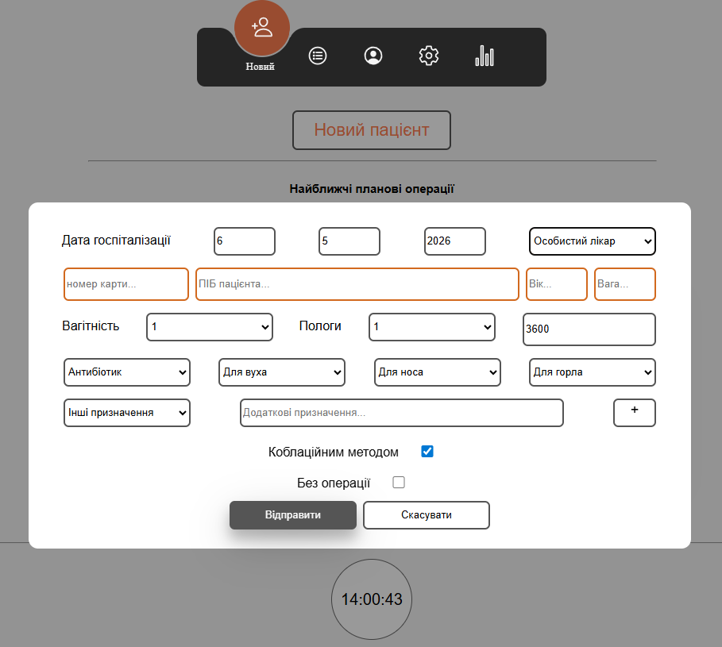
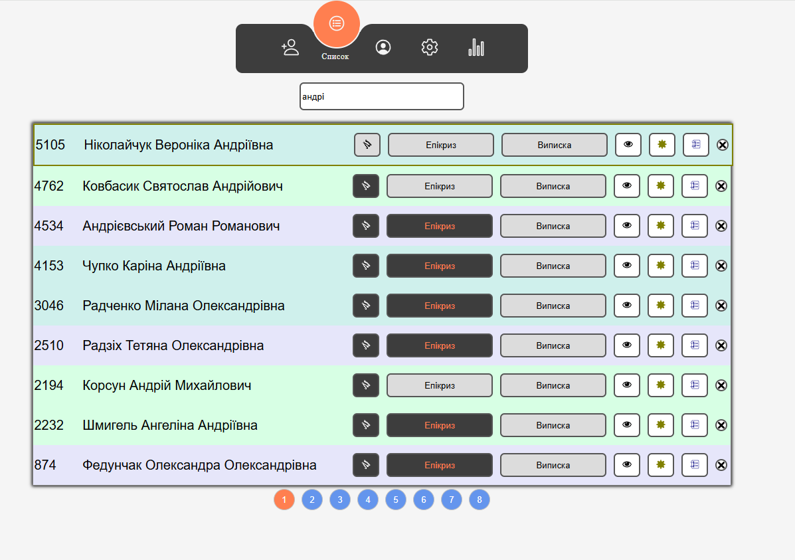
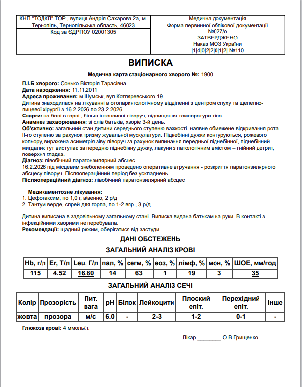

# 👂 ENT Medical Card (Otorhinolaryngology Management System)

A specialized medical ERP system designed for Otorhinolaryngology (ENT) departments. This application automates the generation of complex medical documentation, significantly reducing the administrative burden on surgeons.

**Note:** This project has been successfully utilized by hospital physicians in a clinical environment for over two years, proving its reliability and practical value.

## 🚀 Live Demo

**🔗 [Live Demo (GitHub Pages)](https://olehkuts.github.io/LOR_medical_card/)**

## 📸 Screenshots

|            Primary Patient Form            |          Patient Management List           |
| :----------------------------------------: | :----------------------------------------: |
|  |  |

|           Document Generation Example            |
| :----------------------------------------------: |
|  |

## ✨ Key Features

- **Automated Document Generation:** Creates comprehensive 6-12 page inpatient records specifically tailored for ENT clinical cases.
- **Intelligent Medical Logic:** Numerous built-in functions process form data to automatically generate precise clinical descriptions and medical conclusions.
- **Privacy & Local Storage:** Operates on an "Offline-first" principle using `LocalStorage`. All patient data remains on the user's computer, ensuring maximum confidentiality.
- **Data Portability:** Includes robust Import/Export tools via JSON files for archiving and data migration.
- **Comprehensive Workflow:** Modules for surgical protocols, daily check-up diaries, epicrisis, and discharge summaries.

## 🛠 Tech Stack

- **Frontend:** React (Functional Components).
- **State Management:** `useReducer` with `Context API` for handling high-density medical data.
- **Architecture:** Extensive use of **Custom Hooks** for modular logic, validation, and LocalStorage synchronization.
- **Utilities:** `uuid` library for unique patient identification.
- **Deployment:** GitHub Pages.

## 📁 Application Structure

1.  **New Patient:** A detailed interface for recording anamnesis, symptoms, and objective ENT examinations.
2.  **Patient List:** A management dashboard featuring pagination and quick access to clinical records.
3.  **Medical Card:** A real-time preview and editing engine for generated documents before printing.
4.  **Settings:** Configurable profiles for doctors, nursing staff, and clinic-specific headers.
5.  **Statistics:** Data visualization for treated cases per physician.

## 🚀 Local Development

1. **Clone the repository:**
   ```bash
   git clone https://github.com
   ```
2. **Install dependencies:**
   ```bash
   npm install
   ```
3. **Start the development server:**
   ```bash
   npm start
   ```

---

_Developed by [Oleh Kuts](https://github.com/OlehKuts)_
